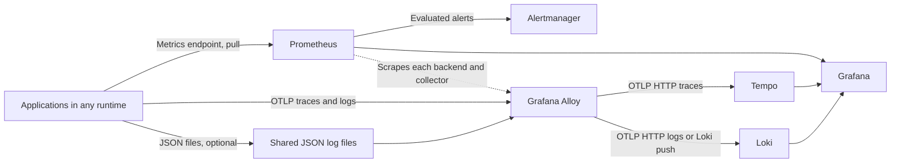

# Architecture

## Scope and boundaries

The repository is a reusable local observability stack, with a migration path to an operated production system. Its integration boundary is protocol-based. An API, worker, scheduled job, or service written in any runtime can participate if it exposes metrics or sends supported telemetry. The examples demonstrate these boundaries with a NestJS API and a Python HTTP service; adding a third language does not require changing the storage topology.

The local stack is single tenant and runs all storage on one Docker host. It has no availability guarantee if that host or disk fails. Loopback binding limits host exposure; containers on the Compose network can access internal services. Grafana requires login, while telemetry APIs rely on local isolation rather than application authentication.

## Data flow

| Component | Responsibility | Local durable state |
| --- | --- | --- |
| Prometheus | Pull metrics, evaluate rules, notify Alertmanager | TSDB and WAL in `prometheus-data` |
| Alloy | Receive OTLP, limit memory, batch, retry, tail JSON files | OTLP exporter queues and file offsets in `alloy-data` |
| Loki | Index and query logs | TSDB index, chunks and compactor state in `loki-data` |
| Tempo | Store and query traces | WAL and blocks in `tempo-data` |
| Grafana | Provisioned dashboards, Explore and signal correlation | Users and user-created dashboards in `grafana-storage` |
| Alertmanager | Group alerts and store silences | Notification state and silences in `alertmanager-data` |
| Demo services | Demonstrate instrumentation independent of storage | Rotating log files in `app-logs` |

A small readiness sidecar queries all six backend endpoints so `docker compose up --wait` can detect startup failures without adding shell utilities to vendor images. It does not restart an unhealthy backend automatically. A one-shot initializer assigns ownership of the Alloy, Tempo and application log directories. It has no network, a read-only root filesystem and only the `CHOWN` capability; it does not recursively rewrite restored data ownership.

## Local capacity and retention

| Setting | Default | Interpretation |
| --- | --- | --- |
| Prometheus retention | 7 days, 2 GB | Whichever retention constraint is reached first; WAL and temporary compaction files need additional space |
| Loki retention | 7 days | Compactor deletes asynchronously, with a 2-hour deletion delay; no hard disk byte quota |
| Tempo retention | 24 hours | Overrides default compaction retention; deletion is asynchronous |
| Alloy memory limiter | 192 MiB with 48 MiB spike margin | Applies to the OTLP path; pressure can refuse incoming telemetry |
| Alloy OTLP queue | 256 batches per signal/exporter, 2 consumers | Disk-backed queue capacity is measured in batches, not bytes |
| OTLP batch | 256 spans/logs, maximum 512, 1-second timeout | Acknowledged data still in the batch processor can be lost on crash |
| Export retry | 1–10 seconds, maximum 5 minutes per export attempt | Data can be dropped when retry time or queue capacity is exhausted |
| File log forwarding | 256 KiB batch, 10 retries with 0.5–5-second backoff | No durable outgoing file-log WAL is enabled |
| Demo files | 10 MiB per active file, two backups | Rotation bounds demo file usage; the collector watches active `*.log` files |
| Docker log rotation | 10 MB, three files per container | Bounds the Docker JSON log driver independently of the shared demo files |

Container memory limits total roughly 2.5 GiB for the core topology, including the helper containers, plus 384 MiB for the demos. These limits are development guardrails, not a measured production capacity. The OTLP queue is not a disk quota; apply filesystem monitoring and storage limits before increasing traffic. Local time retention alone cannot prevent disk exhaustion.

## ADR 001: Use open telemetry contracts

**Decision:** Prometheus pull metrics, JSON file or OTLP logs, and OTLP traces form the public integration boundary. Use stable service identity and W3C trace context.

**Reason:** Instrumentation remains inside each application or its runtime agent. Storage configuration can be reused across frameworks and languages. Prometheus pull metrics keep target health visible through `up` and make backend alerts easy to inspect.

**Consequences:** The shipped application dashboards use explicitly documented metric names and bounded labels. Other names need a mapping or different dashboard queries. OTLP metrics are not wired to a backend in this starter. The examples share a contract rather than a reusable application library.

## ADR 002: Replace Promtail with Alloy

**Decision:** Alloy receives OTLP signals and tails local JSON files.

**Reason:** [Promtail reached end of life on March 2, 2026](https://grafana.com/docs/loki/latest/send-data/promtail/). One collector handles the supported log and trace paths and exposes its own health metrics.

**Consequences:** The Docker socket is not mounted. Applications using the file route explicitly mount `app-logs`; unrelated container stdout is not collected automatically. Existing Promtail paths and label queries require migration.

## ADR 003: Keep local storage monolithic

**Decision:** Use Loki TSDB schema v13 with filesystem storage, Tempo `-target=all` with local blocks, and named volumes for all state.

**Reason:** This creates a small reproducible local topology. [Tempo monolithic deployment](https://grafana.com/docs/tempo/latest/set-up-for-tracing/setup-tempo/plan/deployment-modes/) does not need Kafka; its distributed topology has different requirements. An explicit Loki configuration argument ensures the mounted file is actually loaded.

**Consequences:** This topology has one failure domain and no replicated storage. Scaling into production requires a deployment decision, object storage where appropriate, backup ownership and a measured resource budget. Schema and version upgrades must preserve old data configurations.

## ADR 004: Persist OTLP queues with an explicit preview dependency

**Decision:** Enable `otelcol.storage.file` with `fsync=true` and persistent queues for the Loki and Tempo OTLP exporters. Run Alloy with `--stability.level=public-preview`.

**Reason:** [The pinned file storage component is public preview](https://grafana.com/docs/alloy/latest/reference/components/otelcol/otelcol.storage.file/). It permits a short backend outage to survive collector termination while retaining a bounded retry queue. The integration test kills Alloy with SIGKILL after verifying a queued item, restarts it and queries the original log and trace from storage.

**Consequences:** This is a tested local configuration, not a guarantee of zero loss or exactly-once delivery. Acceptance into a production system needs an owner for this preview dependency, or migration to a collector/storage combination that meets the required stability policy. Retry duplicates are possible. SDK buffers, the memory limiter, batching, permanent errors, exhausted queues and disk failure remain loss boundaries. File-tail forwarding follows a separate path and has weaker outage durability.

## ADR 005: Provision configuration and verify behavior

**Decision:** Pin versions and digests, provision stable data source/dashboard UIDs, validate with vendor binaries, test alerts with `promtool`, and exercise the full pipeline in CI on Linux amd64 and arm64.

**Reason:** Valid YAML does not prove the mounted configuration is loaded, an SDK is initialized early enough, a derived field works, or state survives a restart. Behavior checks query storage using unique markers rather than relying on successful SDK export calls.

**Consequences:** Generated dashboards are edited through `scripts/generate_dashboards.py`. Credentials remain outside Git. Backup tests use a stopped source stack and empty target volumes, preserving ownership and checksums. Hosted authentication, notification delivery, availability and load testing are separate production acceptance gates.
